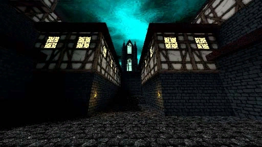
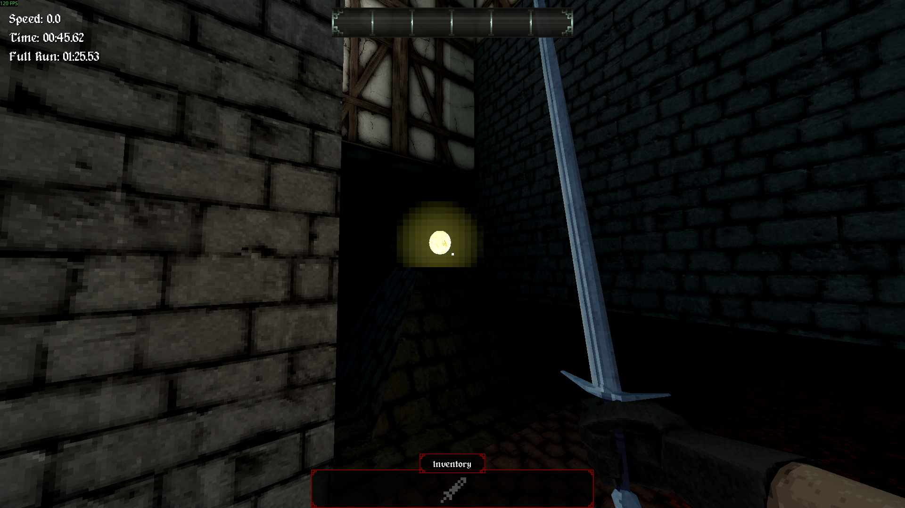
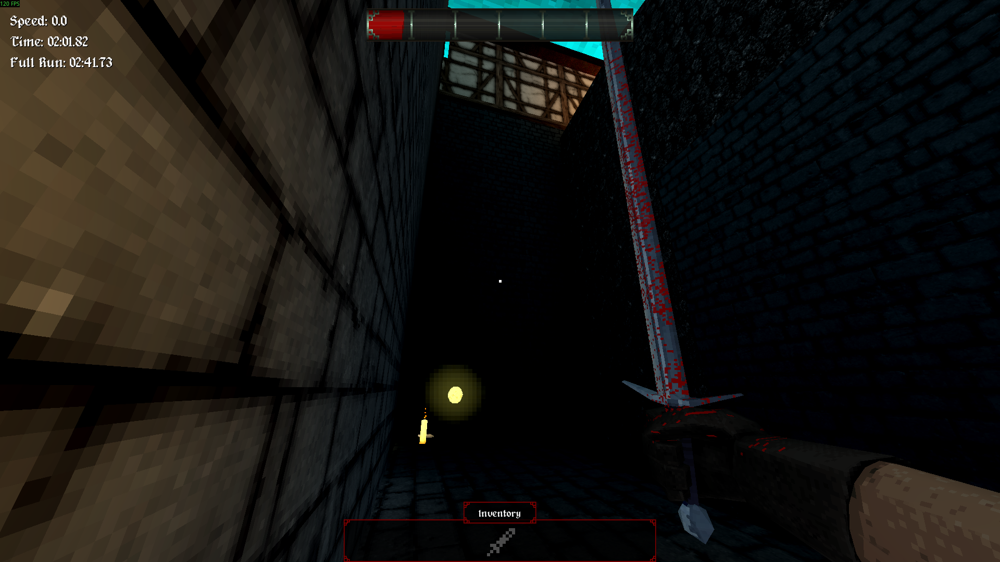
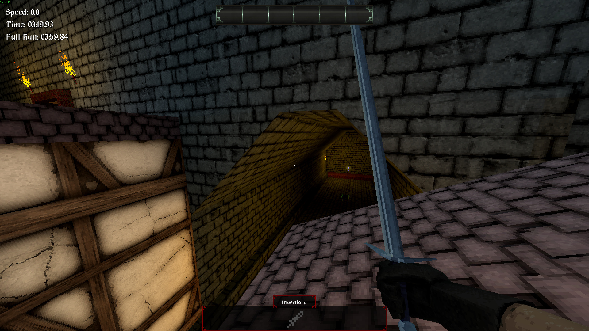
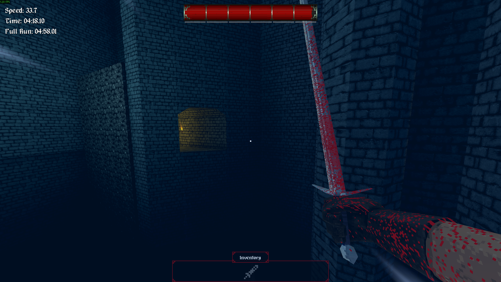
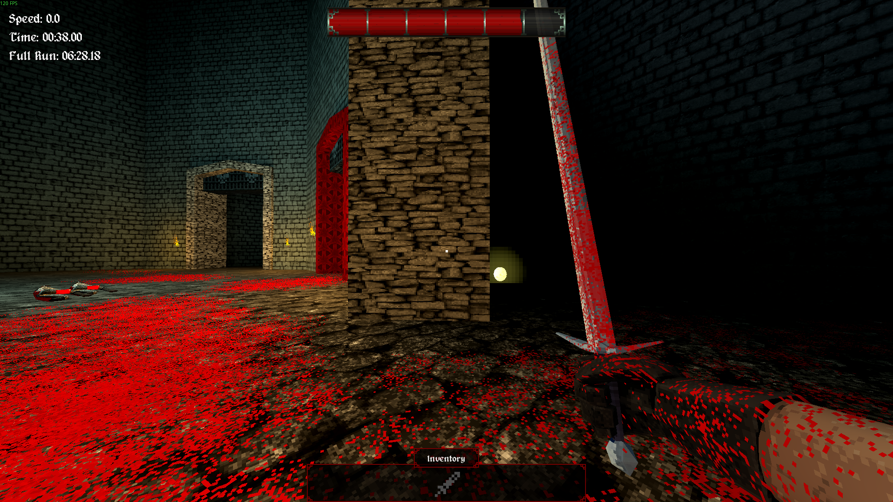

# [1-1] Varu Underbelly

##Description

Neglected, crime-ridden borough within the capital city. Once ruled by cutpurses and black market syndicates, now shrouded in a monstrous darkness from an unknown source.

##Medal times

||Required Time|Reward|
| ----------- | ------------------------------------ |------------------------------------|
|| 00:38.000| |
||00:45.000| |
||01:05.000| |
||01:35.000| |
||-|Ancient Varu Brick|

## Secret Locations

5 total secrets, 3 eyes

Secret 1/5:
Immediately turn right upon starting the level and scale the wall. There you will find an eye collectable (1/3).

Secret 2/5:
Play the level as normal until you come to the slope/slide tutorial. Continue straight forward to find an eye collectable (2/3) and a note.

Secret 3/5:
Continue along the lower rooftops from the previous secret and you will find a secret opening containing the rusty iron rod (x sword) and a super speed power up

Secret 4/5:
When you reach the air-dash tutorial (tower section) turn around and you will see an opening. You will need the peculiar key from arxix gate to enter the gate within here to access S-1.

Secret 5/5:
Just before the level-exit, kill the nearby enemies and enter the door on the right for the final secret and eye (3/3)

## Lore Notes

Intro Note: 

Gutter Rat Note:
        We're dining at Bertram's Tavern tonight at midnight. Remember to bring your party favors. Also, wear that silk stocking I gave you.
