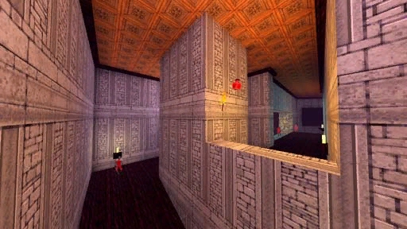

# [1-3] Varu Castle

## Description

The Royal Castle of Varu, built by enslaved Underdwellers during the Greidorian Dynasty. Here the King rests in his bedchamber and here is where he will die by your hand.

## Medal times

||Required Time|Reward|
| ----------- | ------------------------------------ |------------------------------------|
|| 00:12.480|-|
||00:26.000|Calmness Suppressant|
||00:43.000|-|
||01:05.000|-|
||-|Ornate Blade|

## Secret Locations

## Lore Notes
