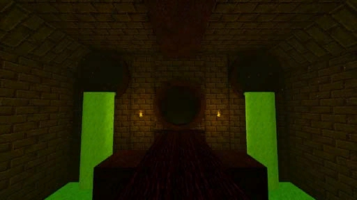

# [1-4] Varu Sewers

## Description

Ancient sewers built by the ingenious Underdweller architects of the first empire. Riddled with spiders and pesky trolls.

## Medal times

||Required Time|Reward|
| ----------- | ------------------------------------ |------------------------------------|
||00:52:00|-|
||01:10.000|Glurm's Walking Stick|
||01:30.000|-|
||02:10.000|-|
||-|-|

## Secret Locations

## Lore Notes

A soaked parchment reads:
Glurm is vexed by an influx of soldiers meandering around in Glurm's sewers. Glurm thinks it strange they emanate from below, not above. Glurm notices they smell different from the humans Glurm is used to."
