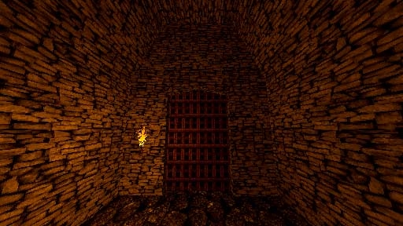

# [1-6] Forgotten Wing

## Description

A sequestered and locked away wing within the blighted holdfast. Dust and ancient rot fill this place.

## Medal times

||Required Time|Reward|
| ----------- | ------------------------------------ |------------------------------------|
|| 01:17.000|-|
||01:30.000|-|
||01:50.000|-|
||02:10.000|-|
||-|-|

## Secret Locations

Entrance to the stone realms are here, locked behind the statues. You will need the godslayer sword and meet the minimum level requirement to enter.

## Lore Notes
