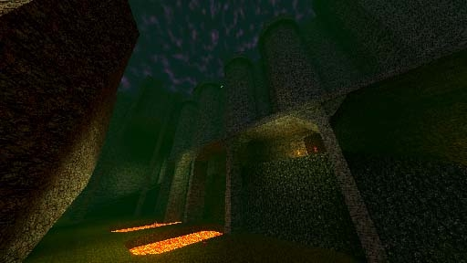

# [1-7] Buried Keep

## Description

An anomalous fortress only accessible by the vast network of tunnels laid by the first Underdwellers of the Shadow Age. Stands sentinel over the path to Arxix.

## Medal times

||Required Time|Reward|
| ----------- | ------------------------------------ |------------------------------------|
|| 00:25.000|-|
||00:34.000|-|
||00:48.000|Loaded Dice|
||01:20.000|-|
||-|-|

## Secret Locations

## Lore Notes
