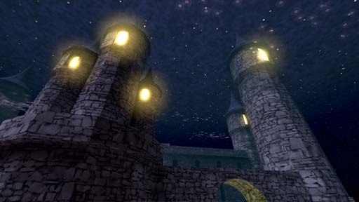

# [2-1] Grand Castle Trixia

## Description

Castle sitting proudly atop in the Mysticlands of Lyralia. Holds the first of the six sacred Phylanxes.

## Medal times

||Required Time|Reward|
| ----------- | ------------------------------------ |------------------------------------|
|| 00:57.000|-|
||01:15.000|-|
||01:25.000|-|
||01:50.000|-|
||-|Trixian Mantle|

## Secret Locations

## Lore Notes
