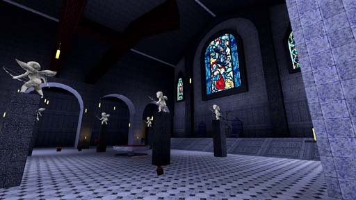

# [2-10] The Celestial Well

## Description

Chapel near Cloud City Nox, rumoured to conceal a Celestial Well - one of the ancient conduits thorugh which mortals once spoke to the gods. Branded heresy by the devout, all known celestial wells were destroyed long ago.

## Medal times

||Required Time|Reward|
| ----------- | ------------------------------------ |------------------------------------|
|| 01:08.350|-|
||01:35.000|-|
||01:50.000|-|
||02:20.000|-|
||-|-|

## Secret Locations

## Lore Notes
