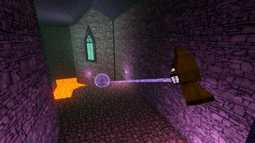

# [2-2] Ignis Morantes

## Description

The waking halls of Castle Trixia. The lords and ladies of this Castle have long left this place, yet the torches remain ablaze.

## Medal times

||Required Time|Reward|
| ----------- | ------------------------------------ |------------------------------------|
|| 00:46.200|-|
||01:07.000|-|
||01:22.000|-|
||02:05.000|-|
||-|-|

## Secret Locations

## Lore Notes
