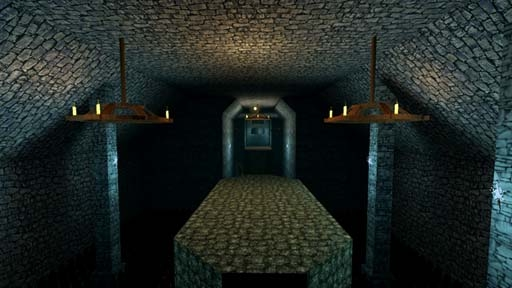

# [2-3] Animae Morantes

## Description

The bowels of Trixia. The Phylanx of the Moon Princess whispers faintly in its infinite halls.

## Medal times

||Required Time|Reward|
| ----------- | ------------------------------------ |------------------------------------|
|| 00:40.550|-|
||00:56.000|-|
||01:04.000|-|
||01:20.000|-|
||-|-|

## Secret Locations

## Lore Notes
