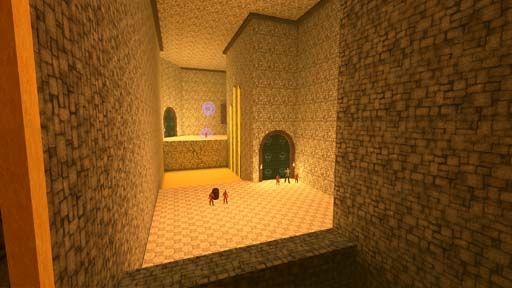

# [2-4] Time Tomb

## Description

A grand tomb for a ruler from long ago. Sheathed by the sands of the Haraku Desert, it is lost to those who cannot trace the magic auras emanating from it. Holds the Phylanx of Khronia, Goddess of Time.

## Medal times

||Required Time|Reward|
| ----------- | ------------------------------------ |------------------------------------|
|| 00:40.000|-|
||00:45.000|-|
||00:55.000|-|
||01:20.000|-|
||-|-|

## Secret Locations

## Lore Notes
