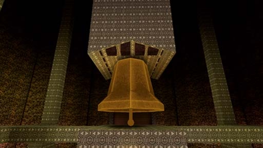

# [2-5] Oex Labor Bell

## Description

A grand belfry standing tall in the interminable Gherisa Swamplands. its bell, untouched for ages, yearns to be rung.

## Medal times

||Required Time|Reward|
| ----------- | ------------------------------------ |------------------------------------|
|| 01:25.010|-|
||01:45.000|-|
||02:25.000|-|
||05:00.000|-|
||-|Trixian Gold-like Alloy|

## Secret Locations

## Lore Notes
