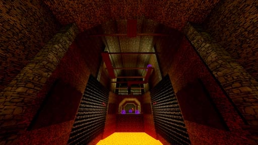

# [2-7] Warded Tunnels

## Description

Vast Tunnels dug by the Underdwellers of a past age. Now an underground stronghold holding Korveth's Phylanx.

## Medal times

||Required Time|Reward|
| ----------- | ------------------------------------ |------------------------------------|
|| 00:44.150|-|
||01:07.000|-|
||01:20.000|Underdweller Blast Powder|
||01:50.000|-|
||-|-|

## Secret Locations

## Lore Notes
