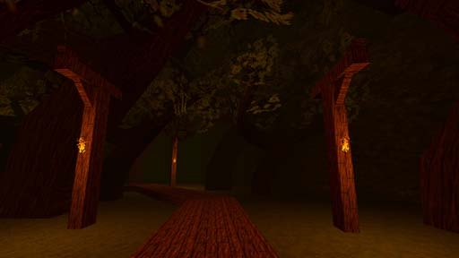

# [2-8] Drowned Temple

## Description

The remains of the Ormus Temple- Once a grand temple sitting atop a sacred city. Plagued by The Thousand Year Torrent, it is now nothing but a ruin in an interminable swamp. Children's tales jeer that the devout monks of Ormus remained in the temple as it drowned. The centuries of putrid blight transformed the monks into monsters cursed to walk the swamps for eternity.

## Medal times

||Required Time|Reward|
| ----------- | ------------------------------------ |------------------------------------|
|| 00:45.670|-|
||01:08.000|-|
||02:00.000|Cat Tail|
||02:40.000|-|
||-|-|

## Secret Locations

## Lore Notes
