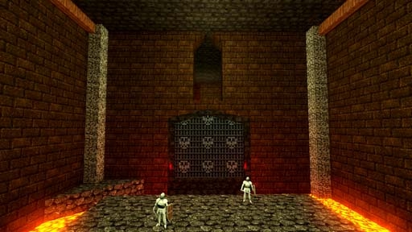

# [2-9] Cloud Castle

## Description

Castle once occupied by Count Hicord - now occupied by the undead armies of Theolmorin

## Medal times

||Required Time|Reward|
| ----------- | ------------------------------------ |------------------------------------|
|| 00:37.200|-|
||00:50.000|-|
||01:15.000|-|
||02:30.000|-|
||-|-|

## Secret Locations

## Lore Notes
