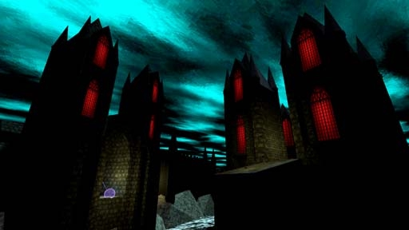

# [3-1] Holy City of Nox

## Description

Sacred city built around the Passageway of Nox, the only known conduit to the Underrealm. Passage is heretical and has been heavily guarded since it was uncovered many ages ago. The few who have passed through have never returned.

## Medal times

||Required Time|Reward|
| ----------- | ------------------------------------ |------------------------------------|
|| 00:32.790|-|
||00:45.000|-|
||01:00.000|-|
||01:15.000|-|
||-|-|

## Secret Locations

## Lore Notes
