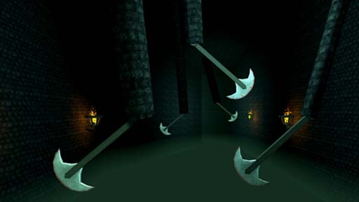

# [3-10] Tomb of the Beasts

## Description

Resting place of the 6 primeval beasts. Theolmorin has awakened and begins to make his ascent to the Overrealm.

## Medal times

||Required Time|Reward|
| ----------- | ------------------------------------ |------------------------------------|
|| 01:03.850|-|
||01:30.000|-|
||03:00.000|-|
||04:00.000|-|
||-|-|

## Secret Locations

## Lore Notes
