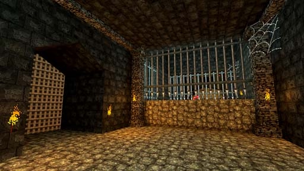

# [3-3] Winding Halls of Nox

## Description

Meandering halls that follow the paths the first mortals took from the Underrealm.

## Medal times

||Required Time|Reward|
| ----------- | ------------------------------------ |------------------------------------|
|| 00:42.670|-|
||01:05.000|Talking Spider|
||01:20.000|-|
||02:10.000|-|
||-|-|

## Secret Locations

## Lore Notes
