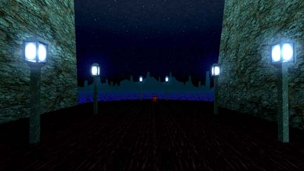

# [3-4] Sea of Souls

## Description

The Vestibule of the Underrealm. An impossible place with no beginning or end, and lost souls drift endlessly.

## Medal times

||Required Time|Reward|
| ----------- | ------------------------------------ |------------------------------------|
|| 01:01.340|-|
||01:25.000|-|
||01:45.000|-|
||02:20.000|-|
||-|-|

## Secret Locations

## Lore Notes
