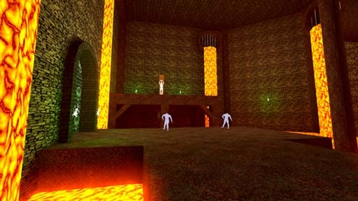

# [3-5] Dungeon of the Undying

## Description

Dungeon thousands of miles deep within the Underrealm. Chained immortals hang on the walls, dying eternally and seeping god blood.

## Medal times

||Required Time|Reward|
| ----------- | ------------------------------------ |------------------------------------|
|| 00:31.970|-|
||00:41.000|-|
||00:51.000|Fire Slug|
||01:11.000|-|
||-|-|

## Secret Locations

## Lore Notes
