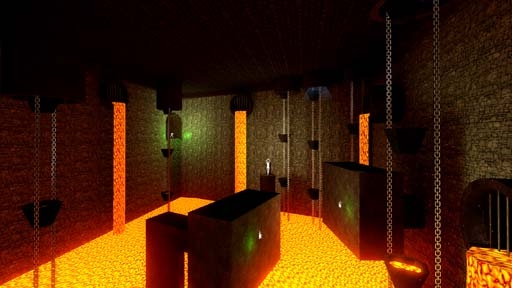

# [3-6] Vessels of Pain

## Description

Further into the Underrealm - rife with souls doomed to an eternity of pain. The lingering auras of the dead Phylanxes begin to whisper of a titanic forge, capable of shaping a blade for killing a god.

## Medal times

||Required Time|Reward|
| ----------- | ------------------------------------ |------------------------------------|
|| 00:41.220|-|
||00:47.000|-|
||01:00.000|-|
||01:30.000|-|
||-|-|

## Secret Locations

## Lore Notes
