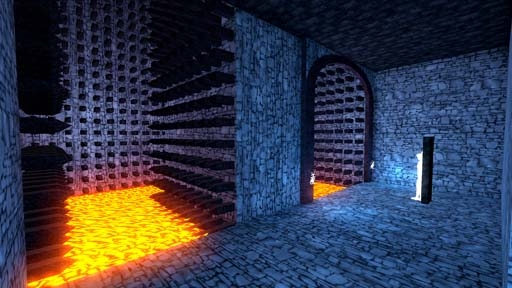

# [3-7] Vessels of Sorrow

## Description

The Lost Stronghold of Nox. Buried within the underworld by demonic magic. The heat of the Elder Forge permeates its walls. The dead Phylanxes whisper that the forge is near.

## Medal times

||Required Time|Reward|
| ----------- | ------------------------------------ |------------------------------------|
|| 00:48.850|-|
||01:07.000|Mummer's Mask|
||01:20.000|-|
||02:00.000|-|
||-|-|

## Secret Locations

## Lore Notes
