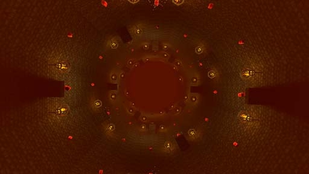

# [3-8] Elder Forge

## Description

Legendary forge buried in the Underrealm that has existed since the dawn of the earth. Mythos says it is the Elder Forge that shaped and wrought the world. Perhaps capable of shaping a sword that can slay a god.

## Medal times

||Required Time|Reward|
| ----------- | ------------------------------------ |------------------------------------|
|| 01:00.000|-|
||01:12.000|Seed|
||01:25.000|-|
||02:20.000|-|
||-|-|

## Secret Locations

## Lore Notes
