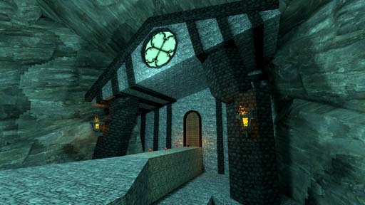

# [3-9] Buried Library of Exrion

## Description

Library built by the first scholars of earth. Lost to the sands of time.

## Medal times

||Required Time|Reward|
| ----------- | ------------------------------------ |------------------------------------|
|| 02:00.950|-|
||02:10.000|-|
||02:35.000|-|
||03:40.000|-|
||-|-|

## Secret Locations

## Lore Notes
