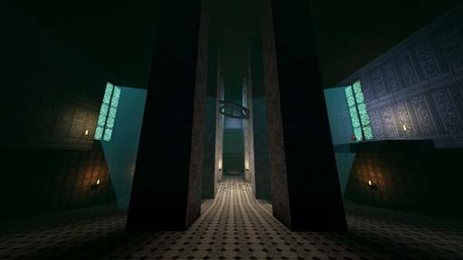

# [S-1] Old Varu Palace

First secret level of the game. Accessed in 1-1.

## Description

The grand heart of Varu in ages past, now entombed beneath the earth.

## Medal times

||Required Time|Reward|
| ----------- | ------------------------------------ |------------------------------------|
|| 01:39.760|-|
||01:50.000|-|
||02:10.000|-|
||04:00.000|-|
||-|-|

## Secret Locations

## Lore Notes
