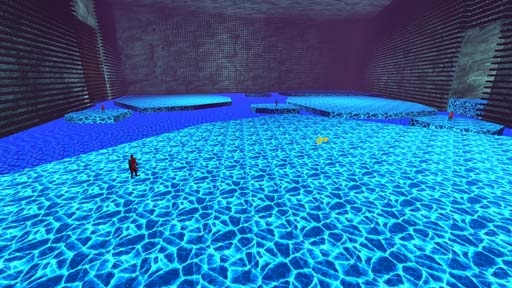

# [S-2] Hadean Permafrost

## Description

The oldest region of the Underrealm and the icy grave of dead souls. Legend has it that before the Elder forge, all of the universe existed as this ever-frozen wasteland.

## Medal times

||Required Time|Reward|
| ----------- | ------------------------------------ |------------------------------------|
|| 00:59.880|-|
||01:10.000|-|
||01:25.000|-|
||02:00.000|-|
||-|Hadean Permafrost Shard|

## Secret Locations

## Lore Notes
